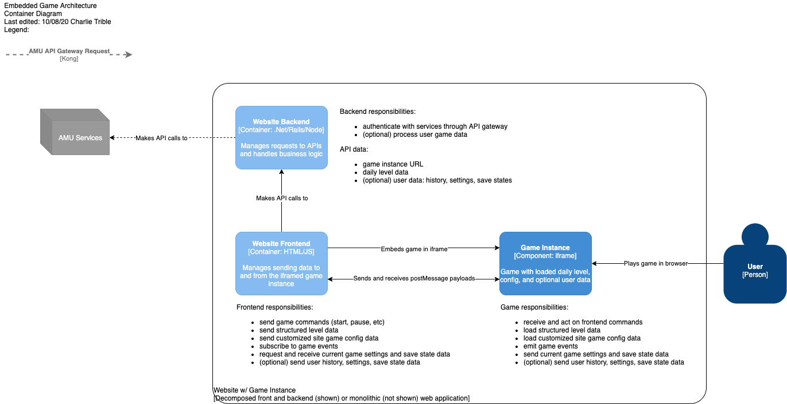

# ES6 Coding Standards

We follow the [Airbnb JavaScript Style Guide](https://github.com/airbnb/javascript), which is sensible and widely adopted, and includes ready-made configs for our linter of choice, [ESLint](https://github.com/Andrews-McMeel-Universal/amu-code_standards/tree/production/javascript/es6/linters).

## Javascript Game Development

AMU HTML5/Javascript games are loaded into webpages within iframes. The website handles initializing the game with whatever data is necessary to run, such as the daily level data.



### Base Data Structure

Game data unique to AMU will be stored in an Object for consistent access and organization.

```javascript
amuGame = {
  gameName: String,
  gameId: Number,
  debug: Boolean, // optional, default: false
  // etc...
};
```

> All dates and times should be compatible with [UTC format](https://developer.mozilla.org/en-US/docs/Web/JavaScript/Reference/Global_Objects/Date/UTC). We recommend using [`Date.now()`](https://developer.mozilla.org/en-US/docs/Web/JavaScript/Reference/Global_Objects/Date/now) to retrieve the current time.

### Communication between the Page and the Game

All interactions between the page and game need to be done through [`window.postMessage`](https://developer.mozilla.org/en-US/docs/Web/API/Window/postMessage) in order to support cross origin requests. These messages are used to exchange data and trigger events, both in the game and on the page.

To ensure the game begins when both the page and game are ready, the initial messages are structured like a handshake. Here is a walkthrough of how to get both the client page and game communicating. First set an event listener and callback to respond to events:

```javascript
// 1. Page

window.addEventListener("message", function (event) {
  // Callback to respond to the message
  handleGameMessage(event);
});
```

Once the client page is ready to listen to events from the game, load the game into a new iframe.

The game should also set a listener as soon as possible, so that it doesn't miss messages from the client page. This illustrates an [IIFE](https://developer.mozilla.org/en-US/docs/Glossary/IIFE), which will run when it is defined, rather than waiting on a page load event:

```javascript
// 2. Game

(function () {
  window.addEventListener("message", (event) => {
    // Always check the origin of the data before responding to messages
    var parentOrigin =
      window.location != window.parent.location
        ? document.referrer
        : document.location.href;

    // Do not proceed if the message came from an unexpected source
    if (!document.referrer.startsWith(parentOrigin)) {
      return;
    }

    // Callback to respond to the message
    handlePageMessage(event);
  });
})();
```

Now that both the client page and the game are capable of listening to one another, the game should dispatch a message to confirm to the page it is ready to receive additional messages:

```javascript
// 3. Game

window.onload = function () {
  var message = {
    amuGame: {
      windowLoaded: true,
    },
  };

  // Set a target window for the message, which will be the client page
  var parentOrigin =
    window.location != window.parent.location
      ? document.referrer
      : document.location.href;

  // Send a confirmation message to the client window
  window.parent.postMessage(message, parentOrigin);

  // Other game initialization can happen here, like mobile detection and resize listeners
  // ...
};
```

The handshake is now complete, and the client page and game can now confidently exchange data. The first command sent to the game will request it to start loading and send whatever data is needed by the game to load the correct level and save state (if any).

```javascript
// 4. Page

function handleGameMessage(event) {
  if (event.data === /* Event for game window load complete */) {
    var message = { initGame: true };
    var frame = document.getElementById(/* game iframe ID */);
    var targetOrigin = /* game source URL */;

    // Send the initialize event
    frame.contentWindow.postMessage(message, targetOrigin);
  }

  // Handle other events as needed
  // ...
}
```

### Messages to the Game

An Object that specifies which command or commands and includes necessary data to fulfill that command. A complete message Object looks like this:

```javascript
let message = {
  // sends instruction to begin game initialization
  initGame: true, // bool
  // sends config data for customizing game look and feel
  loadConfig: /* TBD */,
  // sends level data for each day
  loadLevel: /* TBD */,
  // requests save data that represents a replicable play state
  loadSaveState: /* TBD */,
  // requests data points from the game, see amuGame.data below
  getData: ["all", "currentScore", "totalPlayTime", "saveState"], // array of strings
  // subscribes to an event or events emitted from the game, see amuGame.event
  onEvent: ["all", "start", "pause", "resume", "end", "modeChange"], // array of strings
}

frame.contentWindow.postMessage(message, targetOrigin);
```

### Messages from the Game

The `amuGame` Object that contains data needed by the page. A complete message Object looks like this:

```javascript
let amuGame = {
  gameName: String,
  gameId: Number,
  debug: Boolean, // optional, default: false
  windowLoaded: Boolean, // default: false, confirmation that window.onload is completed
  data: {
    // if the page requests "all", the game should send all data points
    // else it should send only the requested data

    // the current game score
    currentScore: Number,
    // MS since game start, excluding paused time
    totalPlayTime: Number,
    // must recreate current game progress
    saveState: /* TBD */,
  },
  event: {
    // if the page requests "all", the game should emit all events
    // else it should emit only the requested events

    // time the game was started
    start: Number,
    // time the game was paused
    pause: Number,
    // time the game was restarted
    resume: Number,
    // time the game was ended
    end: Number,
    modeChange: {
      // TBD, type may vary on difficulty format per game, ex. "expert" vs 3
      previousMode: String or Number,
      currentMode: String or Number,
    },
  }
};

// sending amuGame to the page:
frame.contentWindow.postMessage({ amuGame.event.start }, targetOrigin);
```
